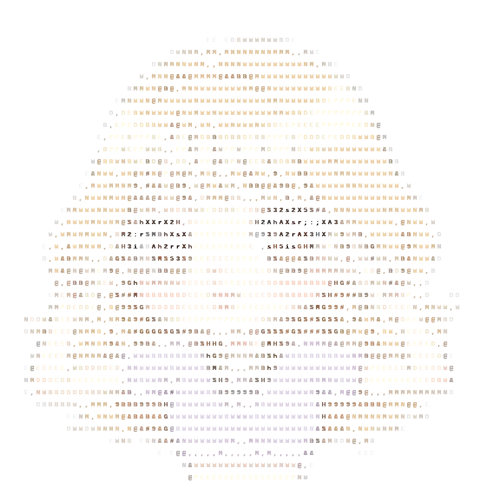

# Akira Maeda

## 💻 Terminal Profile 💻

<table>
  <tr>
    <td width="50%" align="center">
      
    </td>
    <td width="50%" align="left">
      <pre>
akira@gal:~$ whoami
Akira Maeda - Full Stack Developer 💖

akira@gal:~$ cat about.txt
✨ Passionate about creating amazing web experiences
🚀 Always learning new technologies and frameworks
💕 Love working with React, Node.js, and Python
🎨 Enjoy both frontend and backend development
🌟 Committed to writing clean, maintainable code

akira@gal:~$ ls skills/
Frontend: React, Vue.js, TypeScript, HTML5, CSS3
Backend:  Node.js, Express, FastAPI, Python, Java
Tools:     Git, Docker, Linux, MySQL, MongoDB
Design:    Figma, UI/UX, Responsive Design

akira@gal:~$ ./connect.sh
Let's build something amazing together! 💖

akira@gal:~$ █
      </pre>
    </td>
  </tr>
</table>

## 💎 Tech Stack 💎

<pre>
akira@gal:~$ ls tech-stack/
💻 Languages: JavaScript, TypeScript, Python, Java, Go
🎨 Frontend: React, Vue.js, HTML5, CSS3
🔥 Backend: Node.js, Express, FastAPI
🛠️ Others: Git, Docker, Linux, MySQL, MongoDB
🔧 Tools: VSCode, Figma, Slack, Trello, Notion
</pre>

## 🎯 Experience & Background 🎯

<pre>
akira@gal:~$ cat experience.txt
📊 Professional Experience & Education:
</pre>

### 💼 Current Positions

| Position | Company | Period | Description |
|----------|---------|--------|-------------|
| **スタッフ** | [NPO法人 学び足しデザイン工房](https://upskillingjp.org/) | 2026.3 - Present | 教育デザイン・AIリテラシー推進など |
| **スタッフ** | [Simplex Holdings](https://www.simplex.holdings/) | 2026.04 - Present | Financial Technology |

### 💼 Experience（職歴・インターン）

| Position | Company | Period | Description |
|----------|---------|--------|-------------|
| **Web Engineer** | [ハコレコドットコム株式会社](https://www.hakoreco.com/) | 2021.9 - 2026.3 | |
| **Engineer** | [OpenHeart, Inc.](https://openheart.co.jp/) | 2025.5 - 2026.3 | AI画像処理技術開発 |
| **UI Designer** | [サイバーエージェント](https://www.cyberagent.co.jp/) | 2023.3 | |
| **Software Engineer** | [Sony](https://www.sony.com/) | 2023.2 | |
| **Campus Leader** | [Notion](https://www.notion.so/) | 2024.8 - 2025.7 | |
| **Engineer** | [シンプレクス](https://www.simplex.inc/) | 2024.9 | |
| **Web Engineer** | [NAVITIME](https://www.navitime.co.jp/) | 2022.9 | |
| **Designer** | [IBM](https://www.ibm.com/jp-ja) | 2022.9 | |
| **Business Consultant** | [船井総研](https://www.funaisoken.co.jp/) | 2022.8 | |

### 🎓 Education

| Degree | Institution | Period | Field | Achievement |
|--------|-------------|--------|-------|-------------|
| **Master's Degree** | 公立はこだて未来大学大学院 | 2024.4 - 2026.3 | システム情報科学・メディアデザイン | 🏆 日本教育工学会 優秀発表賞（2025.3・2026.3） |

### 🔬 Research

<pre>
akira@gal:~$ cat research.txt
📚 議論を基盤とした学習 × LLMエージェント / AIリテラシー教育
🔗 researchmap: <a href="https://researchmap.jp/akira-maeda">researchmap.jp/akira-maeda</a>
</pre>

- **LLMエージェント** の役割設計・UI/UX
- ワークショップ・科学コミュニケーションを通じた **AIリテラシー教育** の開発と実践
- 生成AIの授業利用・キャリア教育など、**教育工学 / ヒューマンインタラクション** の応用

### 🏆 Awards & Achievements

| Award | Organization | Date |
|-------|-------------|------|
| 🏆 **優秀発表賞** | 日本教育工学会 | 2026.3 |
| 🏆 **優秀発表賞** | 日本教育工学会 | 2025.3 |
| 🥇 **最優秀賞** | P2HACKS 2022 | 2022.12 |

## 🎵 Music Player 🎵

<pre>
akira@gal:~$ ./music.sh
🎵 現在のお気に入り音楽:
</pre>

  <table>
    <tr>
      <td align="center" valign="top" width="33%">
        
         <strong>litty</strong>
      </td>
      <td align="center" valign="top" width="33%">
        
         <strong>badhop</strong>
      </td>
      <td align="center" valign="top" width="33%">
        
         <strong>999dobby</strong>
      </td>
    </tr>
  </table>

## 💌 Contact 💌

<pre>
akira@gal:~$ ./contact.sh
💖 GitHub: <a href="https://github.com/AKMaaa">@AKMaaa</a>
🔬 researchmap: <a href="https://researchmap.jp/akira-maeda">researchmap.jp/akira-maeda</a>
🐦 Twitter: <a href="https://twitter.com/AKMaaa">@AKMaaa</a>
💼 LinkedIn: <a href="https://www.linkedin.com/in/akitch-maeda-akira/">akitch-maeda-akira</a>
🎯 Wantedly: <a href="https://www.wantedly.com/id/akira_maeda_q">akira_maeda_q</a>
📧 Email: <a href="mailto:akira@aiedu.jp">akira@aiedu.jp</a>
</pre>
